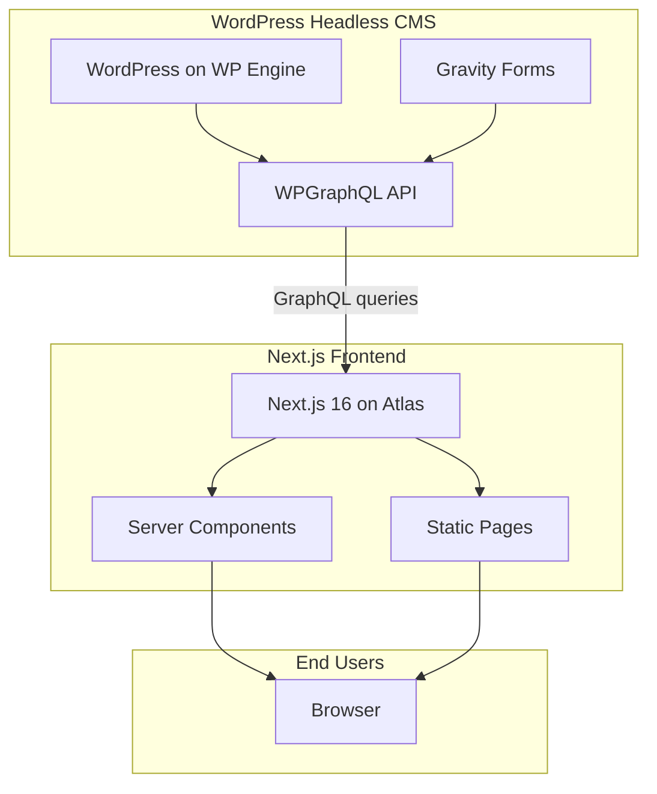

# AmeriLife

Headless WordPress + Next.js marketing site for AmeriLife, deployed on WP Engine Atlas.

## Architecture



- **WordPress** manages content, SEO metadata, navigation, redirects, agency data, leader profiles, and insights articles.
- **Next.js** handles all rendering, layout, and user experience.
- **Gravity Forms** powers all contact and lead capture forms, exposed via WPGraphQL.
- WordPress does not render HTML to end users.

## Quick Start

```bash
# Install dependencies (uses pnpm)
pnpm install

# Copy environment variables
cp frontend/.env.example frontend/.env.local

# Edit frontend/.env.local: set NEXT_PUBLIC_GRAPHQL_ENDPOINT
# Default: https://headlessameril.wpenginepowered.com/graphql

# Run development server (port 3000)
pnpm dev
```

## Project Structure

```
amerilife/
├── frontend/                 # Main Next.js application (all active development)
│   ├── app/                  # App Router: pages, layouts, route groups
│   │   ├── (site)/           # Main site layout (TopBar + Header + Footer)
│   │   ├── (bare)/           # No chrome (legal addendum pages)
│   │   └── (topbar-only)/    # TopBar only (thank-you, lead forms)
│   ├── app/components/       # React components organized by feature
│   ├── lib/                  # Utilities: WP client, queries, agencies, SEO, forms
│   ├── scripts/              # Image sync, agency pipeline, migration, verification
│   └── wp/mu-plugins/        # WordPress must-use plugins
├── docs/                     # Project documentation
├── app/                      # Legacy scaffold (largely empty, not in active use)
├── components/               # Legacy scaffold
└── lib/                      # Legacy scaffold
```

All active development happens in `frontend/`.

## Documentation

| Document | Description |
|----------|-------------|
| [docs/STACK.md](docs/STACK.md) | Tech stack: Next.js, React, Tailwind v4, WPGraphQL, versions |
| [docs/DEVELOPMENT.md](docs/DEVELOPMENT.md) | Local setup, env vars, scripts, workflow |
| [docs/ARCHITECTURE.md](docs/ARCHITECTURE.md) | System overview, data flow, responsibility matrix |
| [docs/ROUTING.md](docs/ROUTING.md) | Route map, catch-all logic, page types |
| [docs/COMPONENTS.md](docs/COMPONENTS.md) | Component library reference |
| [docs/STYLING.md](docs/STYLING.md) | Tailwind v4, design tokens, CSS variables |
| [docs/WORDPRESS.md](docs/WORDPRESS.md) | WordPress integration, GraphQL, Custom Post Types, media sync |
| [docs/FORMS.md](docs/FORMS.md) | Gravity Forms integration: form IDs, submission flow, reCAPTCHA |
| [docs/AGENCIES.md](docs/AGENCIES.md) | Agency/Agent CPT: data model, pipeline, page resolution |
| [docs/DEPLOYMENT.md](docs/DEPLOYMENT.md) | WP Engine Atlas deployment |
| [docs/CONTENT_MODEL.md](docs/CONTENT_MODEL.md) | Content ownership model: system pages vs. CMS-driven pages |
| [docs/DEFINITION_OF_DONE.md](docs/DEFINITION_OF_DONE.md) | Completion criteria for pages, components, and deployments |

## Key Scripts

| Command | Purpose |
|---------|---------|
| `pnpm dev` | Start dev server (Turbopack, port 3000) |
| `pnpm build` | Production build |
| `pnpm start` | Run production server (after `build`) |
| `pnpm lint` | Run ESLint |
| `pnpm -C frontend sync:wp-images` | Sync images to headless WP via SFTP |
| `pnpm -C frontend check:pages-404` | Verify all static routes return 200 |
| `pnpm pipeline:agencies` | Full agency scrape → enrich → LLM-enrich pipeline |
| `pnpm import:all-agencies` | Import enriched agency data into WordPress |
| `pnpm seed:insights:wp` | Seed Insights posts into WordPress |

See [docs/DEVELOPMENT.md](docs/DEVELOPMENT.md) for the full script reference.

## Requirements

- Node.js >= 20
- pnpm (package manager — do not use npm or yarn)
