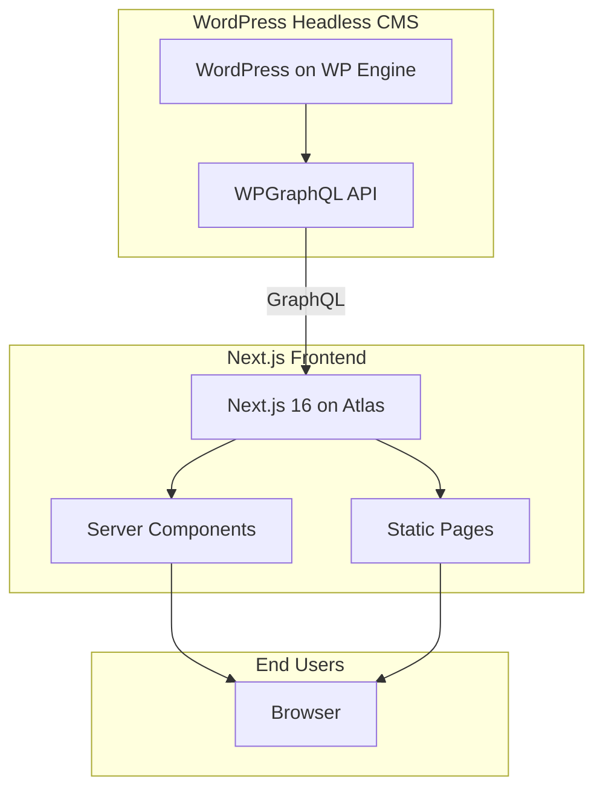

# Architecture

## 1. System Overview

Headless WordPress + Next.js deployed on WP Engine Atlas.

- **WordPress** manages content, SEO metadata, navigation, and redirects.
- **Next.js** handles all rendering, layout, and user experience.
- WordPress does not render HTML to end users.

## 2. Architectural Principles

- Separation of concerns between CMS and presentation
- Reusable component architecture
- Centralized data fetching via `lib/wp-client.ts`
- Environment-safe configuration
- Scalable to 300+ pages

## 3. Responsibility Matrix

### WordPress (CMS Layer)

| Responsible for | Not responsible for |
|-----------------|----------------------|
| Pages (dynamic) | Layout rendering |
| Posts (blog) | Styling |
| SEO metadata (Yoast) | Performance optimization |
| Navigation menus | Routing logic |
| Redirects | UI behavior |
| Editorial workflow | |

### Next.js Frontend

| Responsible for | Must not |
|------------------|----------|
| All UI rendering | Hardcode CMS-driven content |
| Layout (Header, Footer, Templates) | |
| Routing | |
| SEO metadata injection | |
| Responsive behavior | |
| Error handling | |

## 4. Page Ownership Model

### System Pages (Frontend-Owned)

Hardcoded pages with layout and content defined in frontend code. They may fetch images from WordPress but do not fetch page content from WordPress.

Examples: Homepage, About Us, Our Solutions, Find An Agent, Newsroom, FAQ, Lead forms, Legal pages, Location pages, Agent detail pages.

### CMS-Driven Pages (WordPress)

Pages whose content is fetched from WordPress via GraphQL and rendered as HTML.

- Handled by catch-all `[...slug]/page.tsx` when no static route matches
- Content rendered via `dangerouslySetInnerHTML` (raw HTML from Gutenberg)
- SEO from Yoast

### Hybrid

- **Newsroom / Blog**: Listing pages are frontend; individual posts are CMS-driven.
- **Catch-all**: Resolves in order: Agent detail → Location → WordPress page.

## 5. Data Fetching Patterns

Three distinct patterns:

| Pattern | Use Case | Example |
|---------|----------|---------|
| **WPGraphQL** | CMS-driven pages, menus, redirects | `[...slug]`, `LayoutShell`, `newsroom`, `blog/[category]/[slug]` |
| **Static hardcoded** | Marketing pages | About, Solutions, Find An Agent, Location templates |
| **Static search index** | Site search | `lib/search-index.ts` + `SEARCH_POSTS` for blog |

All GraphQL fetches use `cache: "no-store"`. Server Components are preferred.

## 6. Image Strategy

- **Source of truth**: Headless WordPress Media Library (images synced via SFTP or manual upload)
- **URL rewriting**: `lib/wp-media.ts` rewrites `amerilife.com` upload URLs to headless WP when `NEXT_PUBLIC_USE_LIVE_IMAGES=0`
- **Live images**: Set `NEXT_PUBLIC_USE_LIVE_IMAGES=1` to load directly from amerilife.com (e.g. when headless WP lacks images)
- **next/image**: Used for all images; remote patterns whitelisted in `next.config.ts`

## 7. Routing Strategy

| Route Type | Handler | Example |
|------------|---------|---------|
| Static | Explicit `page.tsx` | `/`, `/about-us/who-we-are`, `/find-an-agent` |
| Catch-all | `[...slug]/page.tsx` | Agent detail, Location, WordPress pages |

Catch-all resolution order:

1. 2-segment slug → Agent detail (if in `locations-data`)
2. 1-segment slug → Location page (if in `locations-data`)
3. WordPress → `GET_NODE_BY_URI` → render HTML
4. Not found → 404

See [ROUTING.md](ROUTING.md) for full route map.

## 8. WordPress Page Rendering

CMS-driven pages do **not** use block-by-block rendering. The frontend:

1. Fetches page via `GET_NODE_BY_URI`
2. Applies `rewriteUploadsInHtml()` to page content
3. Renders with `dangerouslySetInnerHTML`

Block mapping to React components is not implemented. Raw Gutenberg HTML is rendered as-is with global content styles.

## 9. Environment Structure

| Environment | Purpose |
|-------------|---------|
| Development | Local (`pnpm dev`) |
| Preview | Atlas preview deployments |
| Production | Atlas production |

All configuration via environment variables. No hardcoded URLs, tokens, or credentials.

## 10. Scalability Goals

- 300+ pages
- Reusable components and templates
- Future Custom Post Types
- Future DAM integration
- Enterprise-level stability
