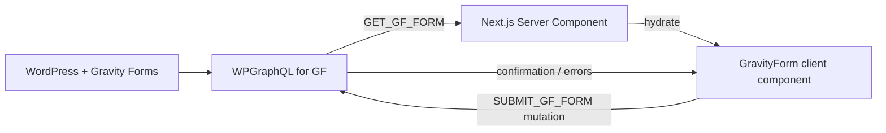

# Gravity Forms Integration

All contact and lead capture forms are powered by **Gravity Forms** on the headless WordPress instance, exposed via the **WPGraphQL for Gravity Forms** (AxeWP) plugin.

## Overview



Server components fetch the form schema (`fields`, `choices`, `labels`) at render time. The `GravityForm` component on the client handles user input, validation, and submission entirely through GraphQL — no REST API calls.

---

## Known Form IDs

Form IDs are WordPress Gravity Forms `databaseId` values. They are declared as named constants in `frontend/lib/gf-client.ts`:

| Constant | Form ID | Used on |
|----------|---------|---------|
| `CONTACT_US_FORM_ID` | `1` | `/contact/` |
| `WORKSITE_LEAD_FORM_ID` | `12` | `/worksite/lead/` |
| `DEFAULT_CONNECT_GF_FORM_ID` | `31` | Agency location pages (default) |
| `VALSPAR_FORM_ID` | `37` | `/valspar/` |
| `HEADER_CONTACT_POPUP_FORM_ID` | `54` | Header "Contact" popup |
| `PRIVACY_ADDENDUM_REQUEST_FORM_ID` | `57` | `/state-specific-privacy-addendum-request/` |

Agency location pages may override the default connect form with a location-specific form ID stored in the `gravityFormId` field on the WordPress Agency CPT. `resolveConnectFormId(location)` in `gf-client.ts` handles this fallback.

---

## Key Files

| File | Purpose |
|------|---------|
| `lib/gf-client.ts` | `fetchGravityForm()`, `submitGravityForm()`, form ID constants, `resolveConnectFormId()` |
| `lib/gf-queries.ts` | `GET_GF_FORM` query and `SUBMIT_GF_FORM` mutation GraphQL documents |
| `lib/gf-types.ts` | TypeScript types: `GfFormData`, `GfFieldNode`, `GfChoice`, `GfSubmitButton` |
| `lib/gf-name-field.ts` | Helpers for rendering split Name fields (first/last/prefix/suffix) |
| `app/components/gravity-forms/GravityForm.tsx` | Reusable client-side form renderer |
| `app/components/gravity-forms/GfRecaptchaField.tsx` | reCAPTCHA v2 invisible field integration |

---

## API Surface

### `fetchGravityForm(databaseId: number): Promise<GfFormData | null>`

Fetches form schema from WPGraphQL. Returns `null` if the form is not found or `databaseId` is invalid.

```ts
import { fetchGravityForm, CONTACT_US_FORM_ID } from "@/lib/gf-client";

const form = await fetchGravityForm(CONTACT_US_FORM_ID);
```

### `submitGravityForm(formDatabaseId, fieldValues): Promise<SubmitGfFormPayload | null>`

Submits field values via the `submitGfForm` GraphQL mutation. Returns a `confirmation` (message or redirect URL), `errors` (field-level), and `entry`.

### `resolveConnectFormId(location: LocationData): number`

Returns the `gravityFormId` from the location's Agency CPT data, or falls back to `DEFAULT_CONNECT_GF_FORM_ID` (`31`).

---

## GravityForm Component

`app/components/gravity-forms/GravityForm.tsx` is a `"use client"` component that:

1. Accepts a pre-fetched `GfFormData` object as a prop (server component fetches, client renders).
2. Renders each field type based on `field.type`.
3. Manages all form state with `useState`.
4. Calls `submitGravityForm()` on submit.
5. Displays the WP-configured confirmation message or redirects on success.

### Supported Field Types

| GF Type | Renders as |
|---------|-----------|
| `TEXT` | `<input type="text">` |
| `EMAIL` | `<input type="email">` |
| `PHONE` | `<input type="tel">` |
| `TEXTAREA` | `<textarea>` |
| `NUMBER` | `<input type="number">` |
| `DATE` | `<input type="date">` |
| `HIDDEN` | `<input type="hidden">` |
| `SELECT` | `<select>` with `<option>` list |
| `RADIO` | `<input type="radio">` group |
| `CHECKBOX` | `<input type="checkbox">` per choice |
| `NAME` | Split inputs for prefix/first/middle/last/suffix |
| `ADDRESS` | Single `<input>` (full address) |
| `CONSENT` | Single `<input type="checkbox">` with label |
| `CAPTCHA` | reCAPTCHA invisible (via `GfRecaptchaField`) |
| `SECTION` / `HTML` / `PAGE` | Skipped (layout-only types) |

### Display Variants

The component supports three visual modes controlled by a `variant` prop:

| Variant | Use Case |
|---------|----------|
| `default` | Standard light background forms |
| `on-dark` | Forms rendered on dark/teal panels |
| `inline` | Compact pill-style (e.g. header contact) |

### reCAPTCHA

Forms with a `CAPTCHA` field use reCAPTCHA v2 Invisible. The token is collected via `GfRecaptchaField` and submitted as a `captchaResponse` value in the payload. The site key is configured in Gravity Forms' reCAPTCHA settings on WordPress.

---

## Submission Payload Format

Field values are passed as an array of objects matching WPGraphQL for Gravity Forms' `FieldValuesInput`:

```ts
[
  { id: 1, value: "John" },          // TEXT, EMAIL, PHONE, etc.
  { id: 2, nameValues: { first: "John", last: "Smith" } },   // NAME
  { id: 3, checkboxValues: [{ inputId: 3.1, value: "Option A" }] }, // CHECKBOX
]
```

The `buildFieldValuesPayload()` function inside `GravityForm.tsx` handles this transformation for all field types.

---

## Adding a Form to a New Page

1. Add the Gravity Form in WordPress and note its **Database ID**.
2. Add a named constant in `lib/gf-client.ts` (e.g. `export const MY_NEW_FORM_ID = 99;`).
3. In your Server Component page, fetch the schema:
   ```ts
   const form = await fetchGravityForm(MY_NEW_FORM_ID);
   ```
4. Pass the form to the `GravityForm` component:
   ```tsx
   {form && <GravityForm form={form} />}
   ```
5. The form renders dynamically from WordPress — no frontend field changes needed for label/choice updates.

---

## WordPress Plugin Requirements

| Plugin | Required for |
|--------|-------------|
| Gravity Forms | Form definitions, submissions |
| WPGraphQL for Gravity Forms (AxeWP) | Exposes forms and submit mutation in GraphQL |
