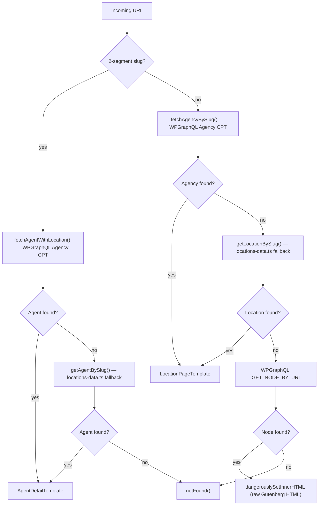

# Routing

Route structure, layout groups, and catch-all resolution logic.

## Route Groups & Layouts

| Group | Layout | Use Case |
|-------|--------|----------|
| `(site)` | `LayoutShell` (TopBar + SiteHeader + SiteFooter) | All main marketing pages |
| `(bare)` | None (no chrome) | Legal addendum pages requiring minimal layout |
| `(topbar-only)` | TopBar only | Minimal-chrome pages (thank-you, lead forms) |

`LayoutShell` is an async Server Component. It fetches navigation menus from WordPress via GraphQL and composes the full site chrome around `children`.

## Static Routes

### Home

| Path | Page |
|------|------|
| `/` | Homepage |

### About Us

| Path | Page |
|------|------|
| `/about-us/who-we-are` | Who We Are |
| `/about-us/our-distribution` | Our Distribution index |
| `/about-us/our-distribution/career-agency` | Career Agency |
| `/about-us/our-distribution/health-distribution` | Health Distribution |
| `/about-us/our-distribution/wealth-distribution` | Wealth Distribution |
| `/about-us/our-distribution/worksite-distribution` | Worksite Distribution |
| `/about-us/our-distribution/direct-to-consumer` | Direct to Consumer |
| `/about-us/our-leaders` | Our Leaders (grid, from WP Leader CPT) |
| `/about-us/our-leaders/[slug]` | Individual leader profile (dynamic, WP Leader CPT) |

### Our Solutions

| Path | Page |
|------|------|
| `/our-solutions` | Our Solutions index |
| `/our-solutions/affiliates` | Affiliates |
| `/our-solutions/agents-and-advisors` | Agents & Advisors |
| `/our-solutions/carriers` | Carriers |
| `/our-solutions/consumers` | Consumers |
| `/our-solutions/employees` | Employees |

### Insights

| Path | Page |
|------|------|
| `/insights` | Insights magazine landing (featured articles grid) |
| `/insights/[slug]` | Individual insight article (WP Insights CPT) |
| `/insights/category/[slug]` | Category listing with pagination |

### Blog / Newsroom

| Path | Page |
|------|------|
| `/newsroom` | Blog listing |
| `/blog/[category]` | Category listing |
| `/blog/[category]/[slug]` | Individual blog post |
| `/blog`, `/blog/` | Redirect → `/newsroom` |
| `/about/news`, `/about/news/` | Redirect → `/newsroom` |

### Locations / Career

| Path | Page |
|------|------|
| `/find-an-agent` | Find An Agent (search + agency cards) |
| `/career` | Career index |
| `/career/agents` | Career agents |

### Lead Forms & Contact

| Path | Page |
|------|------|
| `/connect` | Connect with an agent (Gravity Form) |
| `/contact` | Contact form (Gravity Form) |
| `/existinglead` | Existing lead form |
| `/broker-contact-page` | Broker contact form |
| `/worksite` | Worksite landing |
| `/worksite/lead` | Worksite lead form (Gravity Form) |

### Thank You & Special Landing Pages

| Path | Page |
|------|------|
| `/thankyou` | Generic thank you |
| `/career/findanagentthankyou` | Find agent thank you |
| `/about/affiliates/thank-you` | Affiliates thank you |
| `/valspar` | Valspar landing (Gravity Form) |
| `/sma-amerilife-video` | SMA video page |
| `/kickoff-recap-2025` | 2025 Kickoff recap |
| `/national-network` | National network |
| `/flexibility-and-optionality` | Flexibility & Optionality |
| `/technology-and-analytics` | Technology & Analytics |
| `/solutions-and-opportunities` | Solutions & Opportunities |
| `/givesback` | AmeriLife Gives Back |
| `/join-our-team` | Join Our Team |
| `/expectations-when-you-join-our-team` | Expectations When You Join |

### FAQ

| Path | Page |
|------|------|
| `/faq` | General FAQ |
| `/consumers/faq` | Consumers FAQ |
| `/brokers/faq` | Brokers FAQ |

### Legal

| Path | Page |
|------|------|
| `/privacy-policy` | Privacy Policy (canonical) |
| `/terms` | Terms of Use |
| `/sms-terms` | Redirect → `/sms-text-messaging-terms-and-conditions` |
| `/sms-text-messaging-terms-and-conditions` | SMS Terms (canonical) |
| `/privacy`, `/fbtermsandpolicy` | Redirects → `/privacy-policy/` |

### Bare (no header/footer)

| Path | Page |
|------|------|
| `/state-specific-privacy-addendum` | State Privacy Addendum |
| `/state-specific-privacy-addendum-request` | State Privacy Addendum Request Form |

### Other

| Path | Page |
|------|------|
| `/search` | Site search (static index + WPGraphQL blog search) |

---

## Catch-All (`[...slug]`)

Any URL not matched by a static route above is handled by `(site)/[...slug]/page.tsx`.

This route resolves agency location pages, agent detail pages, and WordPress CMS pages — in that order.

### Resolution Order

**Resolution steps in detail:**

1. **2-segment slug** (`/{agency-slug}/{agent-slug}/`)
   - Try `fetchAgentWithLocation()` — queries the WordPress Agency CPT via GraphQL
   - If not found, fall back to `getAgentBySlug()` from `lib/locations-data.ts`
   - Renders `AgentDetailTemplate`

2. **1-segment slug** (`/{agency-slug}/`)
   - Try `fetchAgencyBySlug()` — queries the WordPress Agency CPT via GraphQL
   - If not found, fall back to `getLocationBySlug()` from `lib/locations-data.ts`
   - Renders `LocationPageTemplate`

3. **WordPress page** — `GET_NODE_BY_URI` → renders Gutenberg HTML via `dangerouslySetInnerHTML`

4. **Not found** → `notFound()` (renders the 404 page)

### Agency Data Sources

**Primary (WordPress Agency CPT):** Agency and agent data is managed in WordPress via the Agency Custom Post Type with custom fields (`phone`, `address`, `hours`, `heroImageUrl`, `featuresJson`, `gravityFormId`, etc.). Agents are a related CPT (`officeAgent`) linked to their parent agency.

**Fallback (Static):** `frontend/lib/locations-data.ts` — used only when a location or agent has not yet been migrated to WordPress. New locations should be added to WordPress, not to this file.

See [AGENCIES.md](AGENCIES.md) for full Agency CPT details and the data pipeline.

### Metadata

| Page type | Metadata source |
|-----------|----------------|
| Agent detail (WP) | `agentDetailMetadata()` in `lib/agencies.ts` |
| Agent detail (static) | `agentDetailMetadata()` using `locations-data.ts` |
| Location / Agency (WP) | `agencyLocationMetadata()` in `lib/agencies.ts` |
| Location (static) | `agencyLocationMetadata()` using `locations-data.ts` |
| WordPress page | Yoast SEO via `yoastSeoToMetadata()` |

---

## Redirects

Redirects are configured in `next.config.ts` via the `redirects()` async function.

**Static redirects** (always applied):

| Source | Destination | Type |
|--------|-------------|------|
| `/blog`, `/blog/` | `/newsroom` | 301 |
| `/about/news`, `/about/news/` | `/newsroom` | 301 |
| `/privacy`, `/privacy/` | `/privacy-policy/` | 301 |
| `/fbtermsandpolicy`, `/fbtermsandpolicy/` | `/privacy-policy/` | 301 |

**Dynamic redirects** (fetched from WordPress at build time): `getRedirectsFromWP()` in `lib/wp-redirects.ts` calls the WPGraphQL Redirection addon to retrieve all redirects configured in the WordPress Redirection plugin. These are merged in after the static redirects and treated as 301s. A 10-second timeout prevents blocking the build.

---

## Sitemap & robots.txt

- **`/sitemap.xml`** — generated by `frontend/app/sitemap.ts` at request time. Combines static marketing paths, WordPress pages, WordPress posts, Leader CPT slugs, Agency CPT slugs (with agent sub-pages), and Insights category slugs.
- **`/robots.txt`** — generated by `frontend/app/robots.ts`. Disallows: `/test`, `/search`, `/thankyou`, `/existinglead`, `/worksite/lead`, `/career/findanagentthankyou`, `/about/affiliates/thank-you`.

---

## Security Headers

Applied globally via `next.config.ts`:

| Header | Value |
|--------|-------|
| `X-Content-Type-Options` | `nosniff` |
| `X-Frame-Options` | `SAMEORIGIN` |
| `Referrer-Policy` | `strict-origin-when-cross-origin` |
| `Permissions-Policy` | `camera=(), microphone=(), geolocation=()` |
