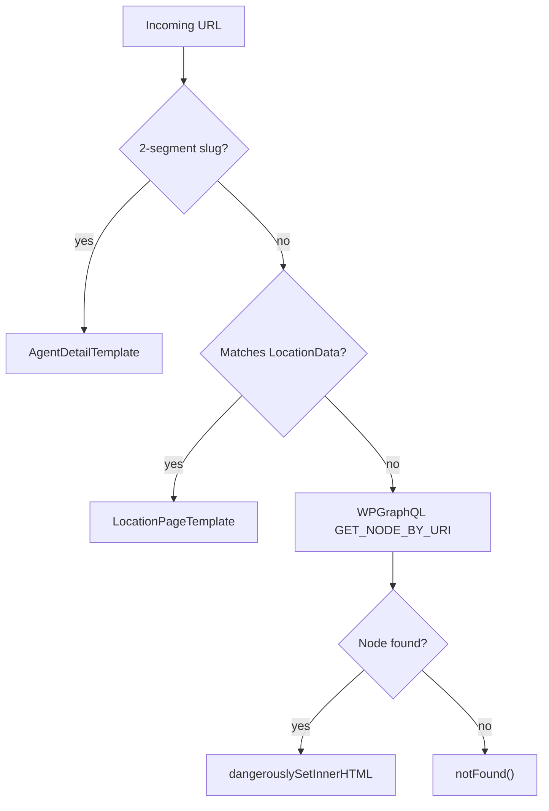

# Routing

Route structure and catch-all resolution logic.

## Route Groups & Layouts

| Group | Layout | Use Case |
|-------|--------|----------|
| `(site)` | `LayoutShell` (TopBar + SiteHeader + SiteFooter) | All main marketing pages |
| `(bare)` | None (no chrome) | Legal addendum pages needing minimal layout |
| `(topbar-only)` | TopBar only | Minimal-chrome pages (e.g. thank-you, lead forms) |

`LayoutShell` fetches navigation from WordPress via GraphQL and composes the full site chrome.

## Static Routes

### Home
| Path | Page |
|------|------|
| `/` | Homepage |

### About Us
| Path | Page |
|------|------|
| `/about-us/who-we-are` | Who We Are |
| `/about-us/our-distribution` | Our Distribution index |
| `/about-us/our-distribution/career-agency` | Career Agency |
| `/about-us/our-distribution/health-distribution` | Health Distribution |
| `/about-us/our-distribution/wealth-distribution` | Wealth Distribution |
| `/about-us/our-distribution/worksite-distribution` | Worksite Distribution |

### Our Solutions
| Path | Page |
|------|------|
| `/our-solutions` | Our Solutions index |
| `/our-solutions/affiliates` | Affiliates |
| `/our-solutions/agents-and-advisors` | Agents & Advisors |
| `/our-solutions/carriers` | Carriers |
| `/our-solutions/consumers` | Consumers |
| `/our-solutions/employees` | Employees |

### Blog / Newsroom
| Path | Page |
|------|------|
| `/newsroom` | Blog listing |
| `/blog/[category]` | Category listing |
| `/blog/[category]/[slug]` | Individual post |
| `/blog`, `/blog/` | Redirect → `/newsroom` |

### Locations / Career
| Path | Page |
|------|------|
| `/find-an-agent` | Find An Agent (search + location cards) |
| `/career` | Career index |
| `/career/agents` | Career agents |

### Lead Forms & Contact
| Path | Page |
|------|------|
| `/connect` | Connect form |
| `/contact` | Contact form |
| `/existinglead` | Existing lead form |
| `/broker-contact-page` | Broker contact |
| `/worksite` | Worksite |
| `/worksite/lead` | Worksite lead form |

### Thank You / Special
| Path | Page |
|------|------|
| `/thankyou` | Thank you |
| `/career/findanagentthankyou` | Find agent thank you |
| `/about/affiliates/thank-you` | Affiliates thank you |
| `/valspar` | Valspar landing |
| `/sma-amerilife-video` | SMA video |
| `/kickoff-recap-2025` | Kickoff recap |
| `/national-network` | National network |
| `/flexibility-and-optionality` | Flexibility |
| `/technology-and-analytics` | Technology |
| `/solutions-and-opportunities` | Solutions & opportunities |
| `/givesback` | Gives back |
| `/join-our-team` | Join our team |
| `/expectations-when-you-join-our-team` | Expectations |

### FAQ
| Path | Page |
|------|------|
| `/faq` | FAQ |
| `/consumers/faq` | Consumers FAQ |
| `/brokers/faq` | Brokers FAQ |

### Legal
| Path | Page |
|------|------|
| `/privacy` | Privacy |
| `/terms` | Terms |
| `/sms-terms` | SMS terms |

### Bare (no header/footer)
| Path | Page |
|------|------|
| `/state-specific-privacy-addendum` | State privacy addendum |
| `/state-specific-privacy-addendum-request` | State privacy addendum request |

### Other
| Path | Page |
|------|------|
| `/search` | Site search |

## Catch-All (`[...slug]`)

Any URL not matched by a static route is handled by `(site)/[...slug]/page.tsx`.

### Resolution Order

1. **2-segment slug** (`/location-slug/agent-slug/`) → `getAgentBySlug()` → `AgentDetailTemplate` if found
2. **1-segment slug** → `getLocationBySlug()` → `LocationPageTemplate` if found (e.g. `/polk-county/`)
3. **WordPress** → `GET_NODE_BY_URI` → render page content via `dangerouslySetInnerHTML` if found
4. **Not found** → `notFound()` (404)

### Location Data

Location slugs are defined in `frontend/lib/locations-data.ts`. Currently: `polk-county`. To add locations or agents, edit that file — see [DEVELOPMENT.md](DEVELOPMENT.md#adding-a-new-location-or-agent).

### Metadata

- **Agent detail**: Custom title/description from agent data
- **Location**: Custom title/description from location data
- **WordPress**: Yoast SEO metadata via `yoastSeoToMetadata()`

## Redirects

- **Static**: `/blog` and `/blog/` → `/newsroom` (in `next.config.ts`)
- **Dynamic**: Fetched from WordPress Redirection plugin at build time via `getRedirectsFromWP()` and merged into Next.js redirects
