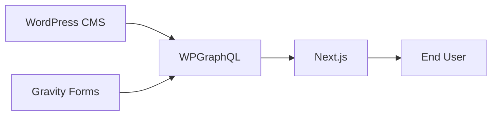

# WordPress Integration

Headless WordPress architecture, Custom Post Types, and integration details.

## Overview

WordPress (hosted on WP Engine) serves as the CMS. It does **not** render HTML to end users. The Next.js frontend fetches all content via GraphQL and renders it.



---

## GraphQL Endpoint

| Environment | Endpoint |
|-------------|----------|
| Production | `https://headlessameril.wpenginepowered.com/graphql` |

Set via `NEXT_PUBLIC_GRAPHQL_ENDPOINT` in `.env.local` or Atlas environment variables.

---

## wp-client.ts

Central GraphQL fetcher at `frontend/lib/wp-client.ts`:

```ts
fetchGraphQL<T>(query: string, variables?: Record<string, unknown>, signal?: AbortSignal): Promise<T>
```

- POSTs to `NEXT_PUBLIC_GRAPHQL_ENDPOINT`
- Uses `cache: "no-store"` (no ISR — all pages are dynamic)
- Throws on HTTP errors or GraphQL errors in the response
- Accepts an optional `AbortSignal` for timeouts (e.g. redirect fetching at build time)

---

## Content Types

### Standard Post Types

| Post Type | Used for | Key queries |
|-----------|----------|-------------|
| `page` | CMS-driven marketing pages (catch-all) | `GET_NODE_BY_URI`, `GET_PAGES_SITEMAP` |
| `post` | Blog / Newsroom articles | `GET_POSTS`, `GET_POST_BY_SLUG`, `GET_POSTS_SITEMAP` |

### Custom Post Types (CPTs)

| CPT | Slug | Used for | Key queries |
|-----|------|----------|-------------|
| Agency | `agency` | Career agency office pages (`/{slug}/`) | `GET_AGENCIES`, `GET_AGENCY_BY_SLUG`, `GET_AGENCIES_FOR_FIND_AGENT` |
| OfficeAgent | `officeAgent` | Agent profile pages (`/{agency}/{agent}/`) | `GET_AGENT_PAGE_DATA`, via `agentByAgencyAndSlug` |
| Leader | `leader` | `/about-us/our-leaders/` and `/about-us/our-leaders/[slug]/` | `GET_LEADERS`, `GET_LEADER_BY_SLUG` |
| Insights | `insight` | `/insights/`, `/insights/[slug]/`, `/insights/category/[slug]/` | `GET_INSIGHTS`, `GET_INSIGHT_BY_SLUG`, `GET_INSIGHT_TOPIC_SLUGS` |

See [AGENCIES.md](AGENCIES.md) for full Agency/OfficeAgent CPT details.

---

## Queries Reference (`lib/queries.ts`)

### Pages & Posts

| Query | Purpose |
|-------|---------|
| `GET_NODE_BY_URI` | Fetch any page or post by URI (catch-all route) |
| `GET_POST_BY_URI` | Fetch a blog post by URI |
| `GET_POST_BY_SLUG` | Fetch a blog post by slug |
| `GET_POSTS` | Paginated blog posts (newsroom listing, category pages) |
| `GET_PAGES_SITEMAP` | Paginated page URIs for sitemap generation |
| `GET_POSTS_SITEMAP` | Paginated post URIs for sitemap generation |

### Navigation

| Query | Purpose |
|-------|---------|
| `GET_MENUS` | All menus |
| `GET_MENU_BY_SLUG` | Menu by slug (used for footer) |
| `GET_MENU_ITEMS_PRIMARY` | Primary nav items (header) |
| `GET_MENU_ITEMS_HEADER` | Header nav items |

### Redirects

| Query | Purpose |
|-------|---------|
| `GET_REDIRECTS` | All redirects from the Redirection plugin (build time) |

### Search

| Query | Purpose |
|-------|---------|
| `SEARCH_CONTENT` | Full-text search across pages/posts |
| `SEARCH_POSTS` | Search blog posts specifically |

### Agencies

| Query | Purpose |
|-------|---------|
| `GET_AGENCIES` | All agency slugs (listing, static params) |
| `GET_AGENCIES_FOR_FIND_AGENT` | All agencies with lightweight fields for Find An Agent page |
| `GET_AGENCIES_FOR_SITEMAP` | Agency slugs + agent slugs for sitemap |
| `GET_AGENCY_BY_SLUG` | Single agency with full fields + nested agents |
| `GET_AGENT_PAGE_DATA` | Single agent + parent agency (agent detail page) |

### Leaders

| Query | Purpose |
|-------|---------|
| `GET_LEADERS` | All leaders (grid listing, static params) |
| `GET_LEADER_BY_SLUG` | Single leader detail |

### Insights

| Query | Purpose |
|-------|---------|
| `GET_INSIGHTS` | Paginated insights list |
| `GET_INSIGHT_BY_SLUG` | Single insight article |
| `GET_INSIGHT_TOPIC_SLUGS` | All insight topic/category slugs |
| `GET_INSIGHT_TOPIC_BY_SLUG` | Topic metadata for category pages |
| `GET_INSIGHTS_ADS_SETTINGS` | Ad configuration from WP options |

All queries that fetch pages or posts include Yoast SEO fields when available:
```graphql
seo { title metaDesc canonical opengraphTitle opengraphDescription opengraphImage { sourceUrl } }
```

---

## SEO (`lib/seo.ts`)

`yoastSeoToMetadata(seo, fallbackTitle)` maps Yoast GraphQL data to the Next.js `Metadata` object:

- Title (with ` | AmeriLife` suffix applied via Yoast title template)
- Meta description
- Canonical URL (rewritten to frontend domain if `NEXT_PUBLIC_SITE_URL` is set)
- Open Graph title, description, URL, and image
- Twitter card (`summary_large_image`)

`staticPageMetadata(title, description, path)` builds `Metadata` for frontend-owned pages that don't fetch from WordPress.

`getSiteUrl()` returns `NEXT_PUBLIC_SITE_URL` with a fallback to the headless WP URL. Used for canonical URLs and sitemap base.

---

## Navigation Menus (`lib/wp-menus.ts`)

`LayoutShell` calls `getPrimaryMenu()` and `getFooterMenu()` on every render.

**Resolution:**
1. Try WordPress menus (`GET_MENU_ITEMS_PRIMARY`, `GET_MENU_BY_SLUG`).
2. Fall back to hardcoded constants (`STATIC_PRIMARY_NAV`, `STATIC_FOOTER_LINKS`) if WordPress returns no menu.

**To configure menus in WordPress:**
- WP Admin → Appearance → Menus
- Create / edit a menu and assign it to a theme location ("Primary" or "Header")
- Menus must be assigned to a location to be visible in WPGraphQL

**If nav items don't appear:** Confirm the menu is assigned to a location. The static fallback in `lib/wp-menus.ts` takes over otherwise — update `STATIC_PRIMARY_NAV` and `STATIC_FOOTER_LINKS` to change the fallback nav structure.

---

## Media / URL Rewriting (`lib/wp-media.ts`)

### Strategy

| `NEXT_PUBLIC_USE_LIVE_IMAGES` | Behavior |
|-------------------------------|----------|
| `0` (default) | Rewrite `amerilife.com` upload URLs to the headless WP base URL |
| `1` | Load images directly from `amerilife.com` (no rewriting) |

### Functions

| Function | Purpose |
|----------|---------|
| `rewriteUploadsUrl(url)` | Rewrite a single `/wp-content/uploads/` URL |
| `rewriteWpContentUrl(url)` | Rewrite any `wp-content` URL |
| `rewriteUploadsInHtml(html)` | Rewrite all upload URLs in a block of HTML (used for CMS page content) |
| `rewriteWpContentInHtml(html)` | Rewrite all `wp-content` URLs in a block of HTML |

### Live Hosts

`NEXT_PUBLIC_LIVE_UPLOAD_HOSTS` (comma-separated, default: `amerilife.com,www.amerilife.com`). Only URLs from these hosts are rewritten. Add staging hosts here only while migrating legacy media.

---

## Redirects (`lib/wp-redirects.ts`)

`getRedirectsFromWP()` fetches all redirects from the WPGraphQL Redirection Addon **at build time** and returns them in Next.js redirect format. Merged into `next.config.ts`:

```ts
async redirects() {
  const wp = await getRedirectsFromWP();
  return [
    { source: "/blog", destination: "/newsroom", permanent: true },
    // ... other static redirects ...
    ...wp,
  ];
}
```

- 10-second timeout to prevent blocking builds
- Parses PHP-serialized target fields when needed
- All WordPress-managed redirects are treated as 301 (permanent)

---

## Gravity Forms Integration

Gravity Forms on headless WordPress is exposed via the **WPGraphQL for Gravity Forms (AxeWP)** plugin.

- Forms are fetched at page render time using `fetchGravityForm(databaseId)`.
- Form submissions use the `submitGfForm` GraphQL mutation.
- The `GravityForm` React component handles all field rendering and submission client-side.

See [FORMS.md](FORMS.md) for complete Gravity Forms documentation.

---

## Must-Use Plugins (`frontend/wp/mu-plugins/`)

These files must be deployed to the headless WordPress instance. Place them in `wp-content/mu-plugins/` on WP Engine.

### `amerilife-content-importer.php`

- Registers Yoast SEO meta keys as writable via the REST API (`_yoast_wpseo_title`, `_yoast_wpseo_metadesc`, `_yoast_wpseo_canonical`, etc.) — required for the migration scripts to set SEO metadata.
- Adds `POST /wp-json/amerilife/v1/check-slugs` for bulk slug existence checks during post migration (avoids N+1 queries).

### `amerilife-media-importer.php`

- Adds `POST /wp-json/amerilife/v1/import-media`
- Registers SFTP-uploaded files in the WordPress Media Library without requiring SSH
- Auth: Application Password passed in the request body (works when WP Engine strips the `Authorization` header)
- Request body: `{ paths: ["2026/03/image.png"], username?, appPassword?, dryRun? }`

---

## WordPress Plugin Stack

| Plugin | Purpose |
|--------|---------|
| WPGraphQL | GraphQL API layer |
| Yoast SEO | SEO metadata management |
| WPGraphQL Yoast SEO Addon | Exposes Yoast fields in GraphQL |
| Redirection | 301/302 redirect management |
| WPGraphQL Redirection Addon | Query redirects via GraphQL at build time |
| Gravity Forms | Lead capture and contact forms |
| WPGraphQL for Gravity Forms (AxeWP) | Exposes Gravity Forms via GraphQL |

---

## Image Sync Workflow

Images are **not** uploaded during the Next.js build. They must exist on headless WordPress before deployment.

**Option A — Manual upload:** Via WP Admin → Media Library (`https://headlessameril.wpenginepowered.com/wp-admin/upload.php`).

**Option B — SFTP sync script:**
```bash
pnpm -C frontend sync:wp-images
```
Downloads images from `amerilife.com` and uploads via SFTP to headless WP. Requires SFTP credentials in `.env.local`.

**Option C — Download only (no credentials):**
```bash
pnpm -C frontend sync:wp-images:download
```
Downloads images locally without uploading.

**Option D — Media import endpoint:** After SFTP upload, call the `amerilife-media-importer.php` endpoint to register files in the Media Library without SSH.

### `wp-image-sources.ts`

`frontend/lib/wp-image-sources.ts` is the **central registry** for all hardcoded page image URLs. All URLs point at `amerilife.com` (or UAT). The sync script reads from this file to know which images to download and upload.

**When adding images for a new page:** Add the full `amerilife.com/wp-content/uploads/...` URL to `WP_IMAGE_SOURCES`. The `rewriteUploadsUrl()` layer serves them from headless WP in production (`NEXT_PUBLIC_USE_LIVE_IMAGES=0`).

Per-page shell scripts in `frontend/scripts/` (e.g. `sync-career-agency-images.sh`) wrap the main sync for specific page groups.
