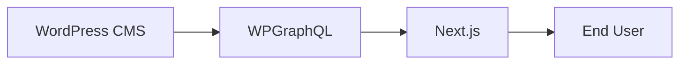

# WordPress Integration

Headless WordPress architecture and integration details.

## Overview

WordPress (hosted on WP Engine) serves as the CMS. It does **not** render HTML to end users. The Next.js frontend fetches content via GraphQL and renders it.



## GraphQL Endpoint

| Environment | Endpoint |
|-------------|----------|
| Production | `https://headlessameril.wpenginepowered.com/graphql` |

Set via `NEXT_PUBLIC_GRAPHQL_ENDPOINT` in `.env.local` or Atlas.

## wp-client.ts

Central GraphQL fetcher in `frontend/lib/wp-client.ts`:

```ts
fetchGraphQL<T>(query: string, variables?: Record<string, unknown>, signal?: AbortSignal): Promise<T>
```

- POSTs to `NEXT_PUBLIC_GRAPHQL_ENDPOINT`
- Uses `cache: "no-store"` (no ISR)
- Throws on HTTP or GraphQL errors
- Supports `AbortSignal` for timeouts

## Queries (lib/queries.ts)

| Query | Purpose |
|-------|---------|
| `GET_NODE_BY_URI` | Fetch any page by URI (catch-all route) |
| `GET_POST_BY_URI` | Fetch post by URI |
| `GET_POST_BY_SLUG` | Fetch post by slug |
| `GET_POSTS` | Paginated posts (newsroom, category) |
| `GET_MENUS` | Menu data |
| `GET_MENU_BY_SLUG` | Menu by slug |
| `GET_MENU_ITEMS_PRIMARY` | Primary nav items |
| `GET_MENU_ITEMS_HEADER` | Header nav items |
| `GET_REDIRECTS` | Redirection plugin data (build time) |
| `SEARCH_CONTENT` | Search content |
| `SEARCH_POSTS` | Search posts |

All queries include Yoast SEO fields when available (`seo { title, metaDesc, canonical, opengraphTitle, ... }`).

## SEO (lib/seo.ts)

`yoastSeoToMetadata(seo, fallbackTitle)` maps Yoast GraphQL data to Next.js `Metadata`:

- Title (with ` | AmeriLife` suffix)
- Description
- Canonical (rewritten to frontend URL if `NEXT_PUBLIC_SITE_URL` is set)
- Open Graph (title, description, url, images)
- Twitter card

## Navigation Menus (lib/wp-menus.ts)

`LayoutShell` fetches navigation via `getPrimaryMenu()` and `getFooterMenu()`. These functions:

1. Try WordPress menus first (`GET_MENU_ITEMS_PRIMARY`, `GET_MENU_BY_SLUG`).
2. Fall back to a **hardcoded static nav** if WP menus are empty or not configured.

**To use WordPress menus:** In WP Admin → Appearance → Menus, create/edit your menu and assign it to a theme location (e.g. "Primary" or "Header"). Menus must be assigned to a location to be visible in GraphQL.

**If nav items don't appear:** Check that the menu is assigned to a location. If WP returns no menu, the static fallback in `lib/wp-menus.ts` (`STATIC_PRIMARY_NAV`, `STATIC_FOOTER_LINKS`) is used. Update those constants to change the fallback nav.

## Media / URL Rewriting (lib/wp-media.ts)

### Strategy

- **`NEXT_PUBLIC_USE_LIVE_IMAGES=1`**: Load images directly from amerilife.com (no rewriting)
- **`NEXT_PUBLIC_USE_LIVE_IMAGES=0`** (default): Rewrite `amerilife.com`/`www.amerilife.com` upload URLs to headless WP base URL

### Functions

| Function | Purpose |
|----------|---------|
| `rewriteUploadsUrl(url)` | Rewrite a single upload URL |
| `rewriteWpContentUrl(url)` | Rewrite any wp-content URL |
| `rewriteUploadsInHtml(html)` | Rewrite all upload URLs in HTML (for page content) |
| `rewriteWpContentInHtml(html)` | Rewrite all wp-content URLs in HTML |

### Live Hosts

`NEXT_PUBLIC_LIVE_UPLOAD_HOSTS` (comma-separated) defaults to `amerilife.com,www.amerilife.com,uatamerilife.wpengine.com`. Only URLs from these hosts are rewritten.

## Redirects (lib/wp-redirects.ts)

`getRedirectsFromWP()` fetches redirects from the WPGraphQL Redirection Addon at **build time** and returns them in Next.js redirect format. Used in `next.config.ts`:

```ts
async redirects() {
  const wp = await getRedirectsFromWP();
  return [
    { source: "/blog", destination: "/newsroom", permanent: false },
    ...wp,
  ];
}
```

- 10s timeout to avoid blocking builds
- Parses PHP-serialized target fields when needed
- All WP redirects treated as permanent (301)

## Must-Use Plugins (frontend/wp/mu-plugins/)

Deploy these to the headless WordPress instance.

### amerilife-content-importer.php

- Registers Yoast SEO meta keys as writable via REST API (`_yoast_wpseo_title`, `_yoast_wpseo_metadesc`, etc.)
- Adds `POST /wp-json/amerilife/v1/check-slugs` for bulk slug existence checks during migration (avoids N+1)

### amerilife-media-importer.php

- Adds `POST /wp-json/amerilife/v1/import-media`
- Registers existing SFTP-uploaded files in the Media Library without SSH
- Auth: Application Password in request body (works when hosts strip `Authorization` header)
- Body: `{ paths: ["2026/03/image.png"], username?, appPassword?, dryRun? }`

## WordPress Plugin Stack

| Plugin | Purpose |
|--------|---------|
| WPGraphQL | GraphQL API |
| Yoast SEO | SEO metadata |
| WPGraphQL Yoast SEO Addon | Exposes Yoast in GraphQL |
| Redirection | Redirect management |
| WPGraphQL Redirection Addon | Query redirects via GraphQL |

## Image Sync Workflow

Images are **not** uploaded during build. Options:

1. **Manual**: Upload via wp-admin Media Library
2. **SFTP script**: `pnpm -C frontend sync:wp-images` — downloads from amerilife.com, uploads via SFTP to headless WP
3. **Media import endpoint**: After SFTP upload, call `/import-media` to register files in Media Library

### wp-image-sources.ts

`frontend/lib/wp-image-sources.ts` is the **central source** for hardcoded page images. All image URLs point at `amerilife.com` (or UAT). The sync script uses these paths when uploading to headless WP.

**When adding images to a new page:** Add the URL to `WP_IMAGE_SOURCES` (or the appropriate nested object). Use the full `amerilife.com/wp-content/uploads/...` path. The `rewriteUploadsUrl()` layer will serve them from headless WP in production when `NEXT_PUBLIC_USE_LIVE_IMAGES=0`.

Per-page sync scripts in `frontend/scripts/` (e.g. `sync-*.sh`) reference these paths when running the main sync.
