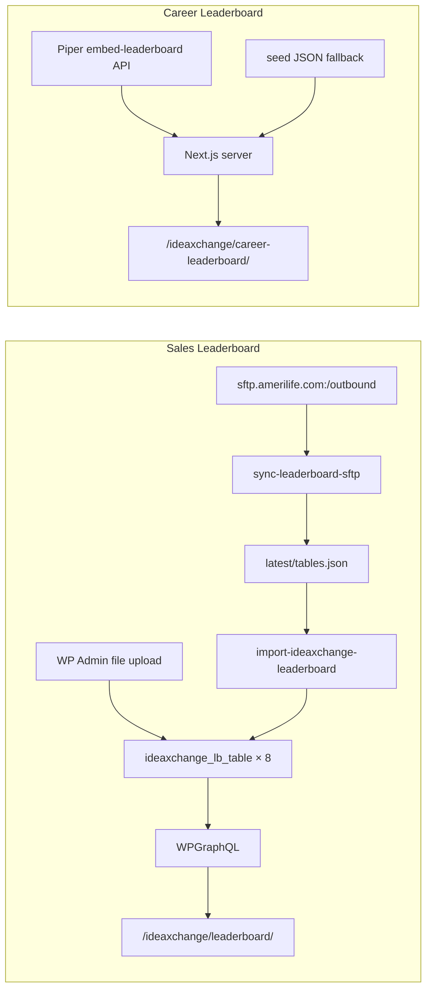

# ideaXchange Leaderboards — How They Work & How They Update

| | |
|---|---|
| **Version** | 1.0 |
| **Author** | Eugenio Elizondo — Klemtek |
| **Date** | August 6, 2026 |
| **Audience** | Marketing / TAB operators, WP content admins, engineering |
| **Related** | [DEPLOYMENT.md](./DEPLOYMENT.md) · [WORDPRESS.md](./WORDPRESS.md) |

Operational guide for **Sales Leaderboard** and **Career Leaderboard**: how data flows, how each source is configured (SFTP vs API), how updates run, and who owns ongoing administration.

---

## 1. Overview

ideaXchange exposes two distinct leaderboard pillars. They do **not** share a data pipeline.

| Pillar | Frontend route | Audience | Data source | Storage |
|--------|----------------|----------|-------------|---------|
| **Sales Leaderboard** | `/ideaxchange/leaderboard/` | Brokerage | AmeriLife outbound **SFTP** (CSV) → WordPress CPT | 8 fixed `ideaxchange_lb_table` posts (7 production + E&O) |
| **Career Leaderboard** | `/ideaxchange/career-leaderboard/` | Career | **Piper incentives API** (live, server-side) | No WP storage; fetched at request time |



---

## 2. Sales Leaderboard — management and maintenance

### 2.1 Fixed tables (do not create or delete)

WordPress automatically ensures exactly **eight** published table posts (7 production + E&O). Admins cannot add or delete them from the UI.

| Slug | Display name | Section | Schema |
|------|--------------|---------|--------|
| `life` | Life | Life Production | Standard (YTD / %) |
| `life-fe` | Life (FE) | Life Production | Standard |
| `life-non-fe` | Life (Non-FE) | Life Production | Standard |
| `annuity-production` | Annuity Production | Submitted Production | Standard |
| `medicare-supplement` | Medicare Supplement | Submitted Production | Standard |
| `medicare-advantage` | Medicare Advantage | Submitted Production | Standard |
| `health-specialty` | Health Specialty | Submitted Production | Standard |
| `oe` | E&O | E&O | E&O (Rank / Affiliate / New Policies) |

**WP Admin:** **ideaXchange Leaderboard** → open a table → upload data → set **Report date** → **Update**.

### 2.2 Row schema

**Standard production tables** normalize each row to:

| Field | Notes |
|-------|--------|
| `affiliate` | **Required.** Also accepts headers: affiliate name, company, name |
| `ytd` / `lytd` | Counts; formatted with thousands separators |
| `vs_lytd` / `vs_lqtd` / `vs_lmtd` | Percents (Excel decimals like `0.221` → `22.10%`) |
| `trend` | Normalized to `up` / `down` / `flat` (supports ▲▼⬤, Excel Wingdings `p`/`q`, and text) |

**E&O (`oe`)** uses Affiliate + New Policies (ranked names). New Policies is stored in the `ytd` field for consistency; the frontend renders the E&O columns separately.

**File formats (manual upload):** `.xlsx` / `.xlsm` (recommended — preserves trend symbols), `.csv`, `.json`.

Saving an upload **replaces all rows** for that table.

### 2.3 Manual update (WP Admin)

Use when SFTP/CI is unavailable or for a one-off correction:

1. Sign into headless WP (`headlessameril.wpenginepowered.com`) as Editor or Admin.
2. Open **ideaXchange Leaderboard**.
3. Edit the target table.
4. Choose a data file (`.xlsx` preferred).
5. Set **Report date** (shown on the frontend as “Last updated”).
6. Click **Update**.
7. Confirm the preview shows the expected affiliate count and sample rows.
8. Verify the live page: `/ideaxchange/leaderboard/`.

**Seed (demo / empty env only):**

```bash
cd frontend
node scripts/seed-ideaxchange-leaderboard.mjs --force
```

Requires a WordPress Application Password for a user with `edit_posts` (not `mediauploader`).

### 2.4 Automated SFTP → WordPress import

Brokerage product files are dropped on AmeriLife outbound SFTP (typically **weekly**). A daily job pulls new/changed CSVs and imports them into the CPT.

**Remote naming:** `Product_MMDDYYYY.csv`  
**Examples:** `Life_07202026.csv`, `MedSup_07202026.csv`, `MA_07202026.csv`

| Remote product key | Table slug |
|--------------------|------------|
| `Life` | `life` |
| `Life-FE` | `life-fe` |
| `Life-Non-FE` | `life-non-fe` |
| `Annuity` | `annuity-production` |
| `MedSup` | `medicare-supplement` |
| `MA` | `medicare-advantage` |
| `Health-Specialty` | `health-specialty` |
| `EO` / `OE` / `O&E` | `oe` (E&O — Rank / Affiliate / New Policies schema) |

E&O may ship on a different cadence than the seven production files. Sync attaches the newest `EO_*.csv` into `tables.json` even when its report date differs from the latest standard set.

**Local commands:**

```bash
cd frontend
pnpm sync:leaderboard-sftp:list   # inventory remote CSVs
pnpm sync:leaderboard-sftp        # download + build latest/tables.json
pnpm import:leaderboard           # POST tables.json → WP
```

**Artifacts** (gitignored): `frontend/.cache/leaderboard-sftp/`

- `archive/YYYY-MM-DD/` — raw CSVs
- `latest/tables.json` — payload for WP import
- `manifest.json` — change detection (size + mtime)
- `sync-log.jsonl` — run history

**CI:** `.github/workflows/sync-leaderboard-sftp.yml`

- Schedule: daily **15:30 UTC** (~10:30 America/Denver; files historically land ~15:00 UTC)
- Also: manual `workflow_dispatch`
- Flow: SFTP pull → `pnpm import:leaderboard -- --require-creds` → upload cache artifact (30 days)

**REST endpoint (MU plugin):**

```http
POST /wp-json/amerilife/v1/import-ideaxchange-leaderboard
```

Auth: Application Password for a user with `edit_posts`. Body shape:

```json
{
  "report_date": "2026-07-20",
  "tables": [
    {
      "slug": "life",
      "report_date": "2026-07-20",
      "rows": [
        {
          "affiliate": "Example Agency",
          "ytd": "1234567",
          "lytd": "1000000",
          "vs_lytd": "23.46%",
          "vs_lqtd": "5.00%",
          "vs_lmtd": "1.20%",
          "trend": "up"
        }
      ]
    }
  ]
}
```

Import updates `rows_json`, `row_count`, `last_imported`, `report_date`, and `section_label` on each matching table post.

### 2.5 Sales Leaderboard secrets & env

| Variable | Where | Purpose |
|----------|-------|---------|
| `LEADERBOARD_SFTP_HOST` | GitHub secret / `.env.local` | Default `sftp.amerilife.com` |
| `LEADERBOARD_SFTP_PORT` | optional | Default `22` |
| `LEADERBOARD_SFTP_USER` / `LEADERBOARD_SFTP_PASSWORD` | GitHub secrets | Outbound SFTP (TAB / Marketing) |
| `LEADERBOARD_SFTP_REMOTE_DIR` | optional | Default `/outbound` |
| `WORDPRESS_URL` (or GraphQL origin) | GitHub secrets | Headless WP |
| `WORDPRESS_USER` + `WORDPRESS_APP_PASSWORD` | GitHub secrets | Editor/Admin app password — **not** `mediauploader` |

If WP credentials are missing in CI, the workflow still archives SFTP files and skips import (warning).

**Prerequisite:** Deploy the leaderboard MU plugin so the import route exists:

```bash
node frontend/scripts/deploy-mu-plugins.mjs
```

---

## 3. Career Leaderboard — management and maintenance

### 3.1 How it works

Career standings are loaded **live** from the Piper partner/embed API on each page request (no WordPress CPT, no SFTP).

```http
GET {PIPER_API_BASE_URL}/embed-leaderboard?incentive={type}&year={year}&month={month}
Header: x-api-key: {PIPER_API_KEY}
```

Configured incentive tables:

| Section | Slug | Piper `incentive` |
|---------|------|-------------------|
| Incentive Programs | `kickoff` | `kickoff` |
| Incentive Programs | `bestinclass` | `bestinclass` |
| Incentive Programs | `topproducer` | `topproducer` |
| Incentive Programs | `presidentsclub` | `presidentsclub` |
| Incentive Programs | `halloffame` | `halloffame` |
| Incentive Programs | `topgunlife` | `topgunlife` |
| Incentive Programs | `topgunannuity` | `topgunannuity` |
| Incentive Programs | `topgunmedsup` | `topgunmedsup` |
| Incentive Programs | `topgunspecialty` | `topgunspecialty` |
| Production | `faststart` | `faststart` |

Grouping is **events vs non-events** (Kickoff / Best in Class / Top Producer / President’s Club / HOF / Top Gun under Incentive; Fast Start under Production). Piper’s embed API does **not** expose separate YTD or Monthly incentive types.

Period defaults to the **current calendar year/month**.

### 3.2 Configuration (Atlas)

| Variable | Value | Notes |
|----------|-------|--------|
| `PIPER_API_BASE_URL` | `https://api-incentives-prod.piper.tools` | Server-only |
| `PIPER_API_KEY` | *(from AmeriLife IT)* | Required for live data |
| `PIPER_API_KEY_HEADER` | `x-api-key` | Optional override |

FQDN whitelist (production/staging hostnames) must be approved with AmeriLife IT / Piper owners. Auth failures (401/403) almost always mean key or whitelist issues.

### 3.3 Fallback behavior

If `PIPER_API_KEY` is missing or Piper returns an error, the page serves **seed fallback** data from:

`frontend/wp/mu-plugins/ideaxchange/seed/ideaxchange-career-leaderboard-seed.json`

Operators should treat seed data as non-production. There is no WP Admin screen for Career rows.

### 3.4 Health checks

While signed into ideaXchange:

```http
GET /api/ideaxchange/piper-health
```

Local (never prints the key):

```bash
cd frontend
node scripts/check-piper.mjs
```

---

## 4. Data source configurations — API vs SFTP

| Dimension | Sales (SFTP → WP) | Career (Piper API) |
|-----------|-------------------|--------------------|
| **Source system** | Brokerage outbound file drop | Piper incentives platform |
| **Transport** | SFTP CSV pull | HTTPS JSON |
| **Cadence** | Files ~weekly; job runs daily | Live on page load |
| **Canonical store** | WordPress post meta (`rows_json`) | Piper (no local persist) |
| **Frontend read path** | WPGraphQL → Next.js | Next.js server → Piper |
| **Manual override** | WP Admin upload per table | None (fix API / env / seed) |
| **Who owns credentials** | TAB / Marketing (SFTP) + WP app password | AmeriLife IT (API key + FQDN whitelist) |
| **Failure mode** | Stale WP data until next successful import; seed only if CPT empty | Seed fallback tables |
| **Admin skill required** | File QA + occasional WP upload | Env/secrets + IT coordination |

**Rule of thumb**

- Changing **Sales** numbers → update SFTP files or WP Admin upload; then confirm `report_date` / “Last updated”.
- Changing **Career** numbers → not editable in ideaXchange; data must change in Piper (or fix API access).

---

## 5. Update processes (runbooks)

### 5.1 Normal weekly Sales refresh (automated)

1. Brokerage drops `Product_MMDDYYYY.csv` files into `/outbound`.
2. GitHub Action runs (or wait for next 15:30 UTC schedule / trigger manually).
3. Confirm workflow green; download artifact if needed.
4. Spot-check `/ideaxchange/leaderboard/` — row counts and report date.
5. In WP Admin list view, confirm **Last upload** and **Report date** columns.

### 5.2 Manual Sales refresh (ops / engineering)

```bash
cd frontend
# Ensure LEADERBOARD_SFTP_* and WORDPRESS_* are in .env.local
pnpm sync:leaderboard-sftp:list
pnpm sync:leaderboard-sftp
pnpm import:leaderboard
```

### 5.3 Emergency Sales correction

1. Obtain corrected `.xlsx`/`.csv` for the affected product(s).
2. WP Admin → **ideaXchange Leaderboard** → upload → set report date → Update.
3. Optionally re-run SFTP sync later; a newer remote file will overwrite on next import.

### 5.4 Career Leaderboard not updating / showing seed

1. Confirm Atlas has `PIPER_API_KEY` (and redeploy after setting).
2. Hit `/api/ideaxchange/piper-health` while authenticated.
3. If 401/403: escalate to IT for key rotation or FQDN whitelist.
4. If 200 but empty: confirm Piper period/incentive has data for the current month.

### 5.5 Deploying plugin changes

Sales import and CPT behavior live in:

`frontend/wp/mu-plugins/ideaxchange/amerilife-ideaxchange-leaderboard-cpt.php`

After PHP changes:

```bash
node frontend/scripts/deploy-mu-plugins.mjs
```

Do **not** also copy files into `wp-content/plugins/` (duplicate load / fatal errors).

---

## 6. Future administration requirements

These are ongoing ownership items for stable operations after launch.

### 6.1 Roles and ownership

| Responsibility | Owner |
|----------------|-------|
| Outbound SFTP credentials & weekly file drops | TAB / Marketing / Brokerage data producers |
| WP Application Password for import (`edit_posts`) | WP / platform admin |
| Piper API key, base URL, FQDN whitelist | AmeriLife IT + Piper |
| GitHub Action secrets & workflow health | Engineering |
| Spot-check published leaderboards after refresh | Marketing ops |
| MU plugin deploys & schema changes | Engineering |

### 6.2 Operational checklist (recurring)

- [ ] **Weekly:** Confirm Sales files landed and Action imported (or WP dates moved forward).
- [ ] **Monthly:** Career tables show current period label and non-seed source.
- [ ] **On credential rotation:** Update GitHub secrets (`LEADERBOARD_SFTP_*`, `WORDPRESS_APP_PASSWORD`) and Atlas (`PIPER_API_KEY`).
- [ ] **On hostname change:** Re-whitelist Piper FQDNs; update Atlas env; redeploy.
- [ ] **Retain:** CI artifacts (30 days) + local/archive CSVs for audit if needed.

### 6.3 Known gaps / planned follow-ups

1. **E&O freshness** — Current SFTP file may lag weekly production drops; confirm with Marketing when a newer `EO_*.csv` is expected.
2. **No Career WP editor** — All Career administration is API/env-based; document IT contacts for Piper outages.
3. **Import auth in CI** — Must use Editor/Admin Application Password; `mediauploader` will fail silently or skip.
4. **Trend fidelity** — Prefer Excel for manual uploads; CSV may lose ▲▼ symbols depending on export tool.
5. **Empty CPT fallback** — Frontend falls back to seed JSON if GraphQL tables have no rows; after go-live, empty tables usually mean a failed import, not intentional demo data.

### 6.4 Change-control notes for admins

- Do **not** rename table post slugs; the catalog and SFTP product map depend on them.
- Do **not** delete the eight table posts (UI blocks create/delete).
- Prefer automated SFTP import for routine updates; use WP upload for exceptions.
- Keep Sales and Career troubleshooting separate — different systems, credentials, and failure modes.

---

## 7. Quick reference — code & docs

| Item | Path |
|------|------|
| Sales CPT + REST import | `frontend/wp/mu-plugins/ideaxchange/amerilife-ideaxchange-leaderboard-cpt.php` |
| SFTP sync script | `frontend/scripts/sync-leaderboard-sftp.mjs` |
| WP import script | `frontend/scripts/import-ideaxchange-leaderboard.mjs` |
| GitHub Action | `.github/workflows/sync-leaderboard-sftp.yml` |
| Sales frontend data | `frontend/lib/ideaxchange-leaderboard-data.ts` |
| Career + Piper client | `frontend/lib/ideaxchange-career-leaderboard-data.ts`, `frontend/lib/ideaxchange-piper-api.ts` |
| Sales seed | `frontend/wp/mu-plugins/ideaxchange/seed/ideaxchange-leaderboard-seed.json` |
| Career seed | `frontend/wp/mu-plugins/ideaxchange/seed/ideaxchange-career-leaderboard-seed.json` |
| Deploy env summary | `docs/DEPLOYMENT.md` |
